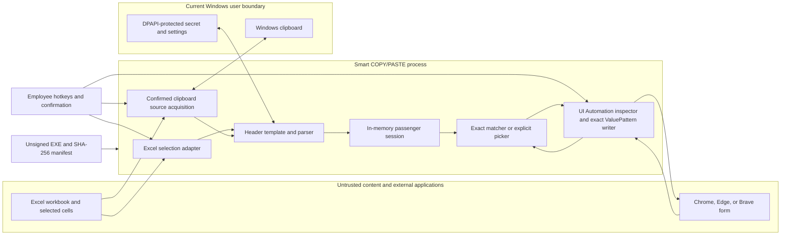

# Smart COPY-PASTE Threat Model

## Executive summary

Smart COPY/PASTE is a local-first Windows tray application that reads selected
passenger rows, keeps them in memory, identifies one focused browser field, and
inserts one value. The data can include passport numbers, dates of birth,
contact details, and other high-sensitivity personal information.

The most important risks are not remote-server compromise because the MVP has
no runtime network service. They are local workflow integrity failures:

1. inserting a correct value into the wrong browser field;
2. inserting a value from the wrong passenger after a focus or passenger
   change;
3. exposing a sensitive value through the Windows clipboard, diagnostics,
   configuration, process memory, or an untrusted local process; and
4. distributing an unsigned executable that recipients cannot strongly
   authenticate.

The design materially reduces those risks by requiring an explicit global
hotkey with at least two of Ctrl/Alt/Shift, using exact and explainable field
matching, blocking protected or
ambiguous controls, revalidating the target, keeping passenger rows
memory-only, binding header profiles to keyed workbook and sheet identities,
and writing only through the freshly revalidated exact browser control's UI
Automation `ValuePattern`. The residual risk remains meaningful on a
compromised Windows account and for unsigned distribution. This MVP should be
treated as a locally testable pilot until Authenticode signing and broader
real-site validation are complete.

## Scope and assumptions

### In scope

- `src/SmartCopyPaste.Core`: header normalization and mapping, parsing,
  matching, session isolation, diagnostics, and settings contracts.
- `src/SmartCopyPaste.App`: tray lifecycle, global hotkeys, Excel COM access,
  exact UI Automation `ValuePattern` browser writes, explicit clipboard source
  acquisition only in four allowlisted source states, DPAPI-backed secrets, and
  per-user persistence.
- `scripts`: restore, build, test, publish, package, install, and uninstall
  workflows.
- The trust relationships among the employee, Microsoft Excel, the app,
  Chrome, Edge, or Brave, the Windows clipboard, the current Windows user
  profile, and distributed release artifacts.

### Out of scope for this MVP

- Browser extensions, native messaging, DOM-level field inspection, saved
  website mappings, and domain/path-aware policy.
- Cloud services, remote APIs, telemetry, central administration, automatic
  updates, or multi-device synchronization.
- Automated full-form completion, button clicks, form submission, OCR, or AI.
- Defending against a fully compromised Windows kernel, administrator, or
  malicious accessibility driver.

### Assumptions

- The employee runs a supported Windows x64 desktop as a standard user and
  controls the interactive session.
- Excel, Chrome, Edge, and Brave are trusted installations; workbook and
  website contents are untrusted inputs.
- Passenger data is highly sensitive PII and disclosure or cross-passenger
  mixing can cause legal, operational, and reputational harm.
- A local process running as the same Windows user may read UI Automation
  metadata, observe keystrokes, monitor the clipboard, modify unprotected
  files, or interfere with focus.
- The release is currently unsigned. SHA-256 verification helps only when the
  expected hash is received through an independent trusted channel.

## System model

### Components

| Component | Responsibility | Trust level and evidence |
| --- | --- | --- |
| Employee | Selects headers/rows, focuses a destination, confirms ambiguous fields, and switches passengers | Trusted operator; workflow in `README.md` and `docs/EMPLOYEE_QUICK_START.md` |
| Excel source adapter | Reads only the foreground Excel selection and derives opaque workbook/sheet identities | Privileged local adapter; `src/SmartCopyPaste.App/Services/ExcelSelectionService.cs` and `WorkbookIdentityService.cs` |
| Core parser and header profile | Validates bounded tabular input and maps selected columns to canonical fields | Security-critical deterministic code; `src/SmartCopyPaste.Core/Parsing/TabularDataParser.cs` and `Headers/` |
| Passenger session | Keeps ordered immutable passenger profiles in memory and controls active/locked state | High-sensitivity in-process store; `src/SmartCopyPaste.Core/Session/PassengerSession.cs` |
| UI Automation inspector and value writer | Reads a focused Chrome/Edge/Brave control, retains its handle for at most 10 minutes, freshly revalidates it, and calls its writable `ValuePattern` | Untrusted metadata boundary and sensitive sink; `src/SmartCopyPaste.App/Services/UiAutomationInspector.cs` |
| Field matcher and picker | Chooses only a unique exact match or requires explicit employee selection | Security decision point; `src/SmartCopyPaste.Core/Matching/FocusedFieldMatcher.cs` and `Forms/ManualPickerForm.cs` |
| Clipboard source-acquisition fallback | After warning and confirmation in one of four allowlisted source states, copies bounded selected tabular text, requires a stable post-read clipboard sequence, then sequence-guards restore or clear | High-risk optional source boundary; `src/SmartCopyPaste.App/Services/SecureClipboardService.cs` |
| Protected settings store | Persists configuration, header profiles, and a user-protected secret, but no passenger rows | Local persistence boundary; `src/SmartCopyPaste.App/Services/ProtectedSettingsStore.cs` |
| Release pipeline | Builds a self-contained EXE/ZIP and records artifact hashes plus clean, dirty, or untracked source provenance and source-tree digest/count | Supply-chain boundary; `scripts/publish.ps1`, `scripts/package.ps1`, and `scripts/install.ps1` |

### Data flows and trust boundaries

The principal trust boundaries are:

- untrusted workbook cells crossing through Excel COM into the parser;
- untrusted browser accessibility metadata crossing through UI Automation into
  the matcher;
- sensitive passenger data crossing from the in-memory session through an
  exact, freshly revalidated UI Automation `ValuePattern` into one browser
  field;
- selected tabular source data crossing the shared Windows clipboard only
  after explicit confirmation for a non-Excel source, exact-access unavailable,
  timeout, or foreground Excel-instance mismatch;
- configuration crossing between the process and the current user's writable
  profile; and
- an externally shared, unsigned artifact crossing onto another employee's
  computer.

## Assets

| Asset | Why it matters | Desired property |
| --- | --- | --- |
| Passenger field values | Passport, identity, travel, and contact data can be used for fraud or privacy harm | Confidentiality; memory-only lifetime |
| Passenger-to-field association | A valid value in the wrong field can corrupt an application | Integrity |
| Active-passenger identity | A cross-passenger paste can create a serious record-integrity incident | Integrity and clear operator visibility |
| Header mappings | They determine how spreadsheet columns become canonical fields | Integrity and source binding |
| Focused-target identity | It determines which control receives sensitive data | Integrity and freshness |
| User-scoped secret | It authenticates opaque workbook/sheet identities | Confidentiality and integrity |
| Settings and diagnostics | They must not become an alternate store of passenger data | Confidentiality and schema integrity |
| Release executable, hashes, and source provenance | Recipients must distinguish the intended binary and its actual clean, dirty, or untracked source state from a modified or misrepresented build | Integrity and provenance |
| App availability and hotkeys | Failure should be obvious and must not leave stale sensitive state | Availability and fail-closed behavior |

## Attacker model

### In-scope attacker capabilities

- Supplies a workbook with misleading headers, formulas, very large selections,
  malformed cells, changed header positions, or duplicate labels.
- Supplies a website whose accessibility labels or automation identifiers are
  misleading, conflicting, oversized, or changed after inspection.
- Runs an ordinary process as the same Windows user that can race focus,
  register conflicting hotkeys, monitor the clipboard, modify user-writable
  files, or inspect the app process with normal user privileges.
- Replaces an unsigned EXE or ZIP on an untrusted distribution channel.
- Has temporary physical access to an unlocked employee session.

### Explicitly out-of-scope attacker capabilities

- Kernel or administrator compromise, malicious firmware, or bypass of Windows
  security boundaries.
- Cryptographic compromise of DPAPI or HMAC without access to the current
  Windows user context.
- Compromise of Excel, Chrome, Edge, or the .NET runtime vendor supply chain.

## Entry points

| Entry point | Untrusted input or action | Security handling | Evidence |
| --- | --- | --- | --- |
| Global hotkeys | Any local application or user can trigger or occupy a shortcut | At least two of Ctrl/Alt/Shift per configured chord, Windows modifier excluded from that minimum, no-repeat registration, visible registration failure, single instance | `src/SmartCopyPaste.Core/Configuration/SettingsValidator.cs`; `src/SmartCopyPaste.App/Infrastructure/GlobalHotkeyService.cs`; `SingleInstanceGuard.cs` |
| Excel selection | Workbook identity, sheet identity, cell text, selection shape, COM behavior | Foreground-process check, timeout, contiguous/shape limits, exact displayed text, keyed identity, saved-header recheck | `src/SmartCopyPaste.App/Services/ExcelSelectionService.cs` |
| Clipboard source-acquisition fallback | Arbitrary selected tabular source text and shared clipboard state in an allowlisted fallback state | Four-state eligibility allowlist, invalid/unknown Excel failures reject without prompt, explicit warning/profile choice, bounded parser, post-read sequence stability check, sequence-guarded snapshot restore or clear; newer third-party clipboard wins | `src/SmartCopyPaste.App/TrayApplicationContext.Commands.cs`; `Services/SecureClipboardService.cs` |
| Browser UI Automation | Accessible name, automation ID, help text, section context, type, state, focus, bounds, and a writable value pattern | Supported-browser restriction, bounded metadata, section-qualifier conflict rules, fail-closed format negation, protected-control block, 10-minute maximum target-handle lifetime, and fresh same-target/semantic/focus/state revalidation before exact `ValuePattern` write | `src/SmartCopyPaste.Core/Matching/FocusedFieldMatcher.cs`; `TargetValueAdapter.cs`; `src/SmartCopyPaste.App/Services/UiAutomationInspector.cs` |
| Field picker | Human selection and optional runtime-only remember choice | One field and one current passenger value; focus restoration and fresh exact-target revalidation; no browser clipboard fallback | `src/SmartCopyPaste.App/Forms/ManualPickerForm.cs`; `TrayApplicationContext.Commands.cs` |
| Local settings files | Corrupt, stale, or tampered JSON/backup and protected secret | Schema validation, DPAPI current-user protection for the secret, fail-closed load, session-only filtering | `src/SmartCopyPaste.App/Services/ProtectedSettingsStore.cs` |
| Command line | `--self-test` or ordinary launch | Fixed argument surface and single-instance guard | `src/SmartCopyPaste.App/Program.cs` |
| Release/install files | Modified EXE, ZIP, scripts, expected hash, or misleading source-state claim | Self-test, single-file validation, artifact SHA-256 manifests, `sourceState`, `sourceSha256`, `sourceFileCount`, and per-user install path | `scripts/publish.ps1`; `scripts/package.ps1`; `scripts/install.ps1` |

## Abuse paths

1. **Spoofed field label causes a wrong-field paste.** A malicious or poorly
   implemented page gives an unrelated input a passport-like accessible name.
   The user focuses it and triggers Smart Paste. Exact matching alone cannot
   prove page semantics. The app reduces likelihood by requiring a unique
   high-confidence match, blocking conflicting terms, performing no automatic
   navigation/submission, and using an explicit picker when uncertain. Generic
   full-number `Include country code` help cannot select the standalone
   calling-code field. Emergency, Previous/Former/Old, and
   Alternate/Secondary section qualifiers block base/current candidates and
   allow only a specialized recommendation or manual completion.

2. **Focus or control semantics change between inspection and write.** The app
   inspects a safe input, then a script, popup, or local process moves focus or
   changes the control before the value is written. A retained target handle
   expires after at most 10 minutes, but age never authorizes a write. The
   implementation freshly checks the exact element, browser process/window,
   focus, complete semantic metadata, protected/editable state, and writable
   `ValuePattern` immediately before `SetValue`. Picker focus restoration is
   followed by the same validation rather than trusting `SetFocus`. Queued or
   pre-commit work is abandoned after three seconds and cannot act later. Once
   `SetFocus`/`SetValue` begins, the app deliberately waits for the provider so
   it cannot report failure while a late side effect remains possible.

3. **Passenger changes during a paste operation.** The employee or another
   command switches from passenger A to B while UI inspection or the picker is
   open. If identity is not rechecked, the visible active passenger and value
   being inserted can diverge. Each paste captures both profile ID and session
   generation and rejects the operation if either changes before the sensitive
   sink; passenger mutation controls are also disabled while the command is
   active. A runtime target mapping may survive clearing one passenger only
   while another remains; clearing the final passenger clears mappings so no
   learned routing state survives without an active session.

4. **Clipboard monitoring or a sequence race captures/substitutes a selected
   passenger source row.** One of the four allowlisted source states occurs,
   the employee accepts the warning, and the source application places its
   selected tabular text on the shared clipboard. The app records that
   selection's sequence and rechecks it immediately after reading. A change
   aborts before parsing or session mutation and preserves the newer owner;
   stable-read cleanup restores or clears only while still owned. These guards
   prevent stale substitution or overwriting a newer value but cannot undo
   Windows or third-party history capture. Browser-field insertion never uses
   this fallback.

5. **A workbook is replaced or its headers are edited after enrollment.** A
   user selects passenger-shaped cells in a different or modified source.
   Persisted keyed workbook/sheet identities and a live header fingerprint
   comparison prevent silent column-count matching. Unsaved workbooks are
   session-only so an unstable identity is not trusted after restart.

6. **User-writable settings are altered to redirect mappings.** A same-user
   process changes JSON aliases or template records. Schema and fingerprint
   validation reject malformed state, while the DPAPI-protected HMAC secret
   prevents an attacker who only copies files to another account from
   fabricating valid source identities. A process already running as the same
   user can still alter files or call DPAPI and is a residual local-compromise
   risk.

7. **Oversized or malformed inputs exhaust resources or destabilize COM/UIA.**
   A workbook selection or browser metadata is unbounded. The app applies row,
   column, string, field-count, and pre-commit timeout limits and rejects
   unsupported shapes. A provider that hangs after exact `SetFocus` or
   `SetValue` begins is awaited to preserve an unambiguous commit result; this
   intentional availability failure may require restarting the app.

8. **Diagnostics or UI notifications become a hidden PII store.** Exceptions
   or logs interpolate raw rows, paths, passport numbers, or field values.
   Diagnostics use outcome codes and redaction; normal errors avoid stack
   traces. Tests and release review must continue checking synthetic
   high-risk sentinels.

9. **A shared unsigned executable is replaced.** An attacker swaps the EXE or
   ZIP while retaining a plausible file name. A separately delivered SHA-256
   value detects modification but provides weaker identity and usability than
   Authenticode. Code signing is required before broad production deployment.

10. **A same-user process observes memory or the destination control.** Malware
    or an accessibility tool can inspect process memory, race UI Automation, or
    observe the destination field. Memory-only storage, bounded target handles,
    fresh validation, and cleanup reduce exposure but do not create a security
    boundary against code executing as the employee. Endpoint protection and a
    trusted workstation remain required.

11. **Negated target formatting is misread as an inverse transformation.** A
    portal says `Do not use capital letters`, `Do not use DD/MM/YYYY`, or
    prohibits a phone format. Inferring lowercase, a different date layout, or
    another phone rewrite could silently corrupt the value. Recognized negated
    case/date/phone instructions therefore keep the source unchanged and return
    an unsafe/manual outcome; negation never authorizes an opposite transform.

12. **A passenger value is inserted into an authentication secret field.** A
    login or verification flow exposes an OTP, one-time PIN, 2FA/MFA, TOTP, or
    authenticator field as an ordinary text/tel control, and a saved mapping or
    picker selection would otherwise bypass type-based protection.
    Authentication metadata is classified before all matching and ranking;
    the control is blocked with no candidates. Exact passenger phrases such as
    `Country code`, `Country calling code`, and `Include country code` are
    deliberately excluded from this authentication block.

## Threat table

| ID | Threat | Preconditions | Impacted assets | Existing controls | Residual gap | Priority |
| --- | --- | --- | --- | --- | --- | --- |
| TM-001 | Wrong-field insertion from spoofed or ambiguous browser metadata | User focuses an attacker-controlled or misleading input | Passenger values; field association | Exact target aliases, winner margin, protected-token block, full-number/calling-code distinction, qualified-section base-field block, explicit picker, one-value action | UIA cannot establish domain, DOM semantics, iframe, or nearby-label context | High |
| TM-002 | Focus or target-semantics time-of-check/time-of-use race | Focus, element identity, metadata, or protected/editable state changes after inspection or picker | Passenger values; target identity | Target handle expires within 10 minutes; fresh exact-element, browser process/window, focus, complete semantic, protected/editable-state, and writable-`ValuePattern` validation immediately before `SetValue`; three-second pre-commit abandonment cannot act later; an in-flight provider call is awaited | Validation and `ValuePattern.SetValue` remain separate calls and cannot be perfectly atomic against a malicious same-user process; a hung in-flight provider sacrifices availability to avoid an ambiguous late write | Critical control implemented; High residual |
| TM-003 | Cross-passenger race or orphaned target mapping | Active profile changes during an asynchronous paste, or the final passenger is cleared | Active-passenger identity; record integrity | Immutable profiles, explicit non-wrapping navigation, lock state, serialized commands, busy-state mutation block, final profile-ID and generation comparison; clearing the final passenger clears runtime mappings | Same-user process compromise remains outside the session object's trust boundary | Critical control implemented; Low workflow residual |
| TM-004 | Clipboard disclosure, stale selection, or mid-read sequence substitution | An allowlisted source state occurs and employee explicitly confirms clipboard acquisition | Passenger values | Four-state eligibility allowlist; invalid/unknown Excel failures never prompt; explicit warning/header profile; bounded read; post-read sequence must match before parsing; guarded restore/clear; newer value wins; browser insertion has no clipboard path | Windows/third-party clipboard history and the source application's copy are outside app control | High |
| TM-005 | Header/template confusion or tampering | Workbook changes, duplicate-looking source, or settings modification | Header mappings; field association | HMAC workbook/sheet identity, header fingerprint, row/column checks, no count-only fallback, DPAPI secret | Same-user compromise can manipulate process/files; user can approve a bad mapping | High |
| TM-006 | Sensitive data written to settings or diagnostics | Error paths serialize raw input or session state | Passenger values; settings; diagnostics | Passenger session is memory-only, DTO allow-list, session-only template filtering, diagnostic redactor | Managed crash dumps or third-party process capture remain possible | High |
| TM-007 | Local input/metadata denial of service | Huge/invalid selection, COM hang, malformed TSV, oversized UIA properties, or provider hang after focus/write commit begins | Availability; stale session | Bounded parser, selection limits, uniqueness checks, invalid Excel selection states reject without clipboard fallback, pre-commit COM/UIA deadlines, fail-closed mutation; started exact UIA side effects are awaited to avoid late writes | Accessibility infrastructure can hang after commit begins and require process restart; this is the intentional atomicity-over-availability tradeoff | Medium |
| TM-008 | Hotkey hijack, collision, or unintended trigger | Another process registers or synthesizes shortcuts | Availability; workflow integrity | Every configurable chord requires two of Ctrl/Alt/Shift, Windows does not count, `MOD_NOREPEAT`, registration validation, single instance, pause | Same-user process can synthesize input; collision can prevent startup behavior | Medium |
| TM-009 | Modified or impersonated release artifact | EXE/ZIP crosses an untrusted channel | Executable integrity; all runtime assets | Published self-test, artifact SHA-256 manifests, hash-checking installer, explicit clean/dirty/untracked source state, source-tree SHA-256, and source-file count | No Authenticode publisher identity or automatic trusted update channel; a recorded dirty/untracked state still requires distributor review | High |
| TM-010 | Same-user process reads memory, races UI Automation, or invokes DPAPI | Employee workstation is already compromised | All passenger and configuration assets | Least privilege, no network listener, minimized lifetime, fresh target validation, explicit clear/lock/exit boundaries | Not defensible within the same compromised interactive account | High residual / environmental |
| TM-011 | Negated format metadata causes an unsafe inverse transformation | Portal exposes a prohibited case, date, or phone format | Passenger value integrity; field association | `TargetValueAdapter` recognizes negation, preserves the source, and returns unsafe/manual; no opposite transform is inferred | UIA may omit or truncate portal guidance, forcing manual completion | High |
| TM-012 | Passenger data inserted into an authentication-secret control | OTP/PIN/2FA/MFA/authenticator field is rendered as ordinary text/tel input | Passenger values; authentication integrity | Bounded authentication classifier runs before saved mapping, matching, and ranking; picker receives no candidates; country-code passenger phrases are explicit non-auth controls | A portal may expose misleading or absent accessibility metadata; uncertain controls must remain manual | Critical control implemented; High residual |

## Criticality calibration

- **Critical release gate:** a plausible ordinary workflow can silently mix
  passengers or send PII to a stale control. TM-002 and TM-003 must fail closed
  before an MVP artifact is shipped for testing.
- **High:** disclosure or integrity loss involving passenger PII is plausible,
  but requires explicit source-acquisition fallback, misleading content, local
  compromise, or an untrusted distribution channel.
- **Medium:** the most likely result is visible local unavailability or a
  blocked workflow without silent disclosure.
- **Low:** cosmetic errors and non-sensitive operational metadata failures are
  not listed unless they contribute to a higher-impact chain.

## Recommended focus paths

1. **Before every V2 build:** verify passenger profile ID and session generation
   after all awaits/dialogs and immediately before the exact
   `ValuePattern.SetValue`; verify same-target identity, semantics,
   protected/editable state, and focus after picker focus restoration. Keep
   `SecureClipboardService` confined to explicit source acquisition.
2. **During manual acceptance:** test focus theft, passenger switching while
   the picker is open, ambiguous passport/visa labels, protected controls,
   full-number country-code help, qualified sections with present and absent
   specialized values, negated formats, OTP/one-time PIN/2FA/MFA/authenticator
   text/tel controls plus benign country-code counterexamples,
   clear-one/clear-final mapping boundaries, unsafe shortcut rejection,
   pre-commit abandonment, in-flight provider stalls, restart recovery, header
   edits, all four clipboard-fallback allowlist states, every rejected Excel
   selection class, a clipboard change during the read, guarded cleanup,
   pause/lock/exit cleanup, and multi-row boundaries.
3. **Before broad sharing:** obtain Authenticode signing, publish the expected
   signer and hash through a trusted channel, and add a repeatable signed
   update process.
4. **For V2:** add a narrowly scoped browser extension/native-messaging
   protocol that supplies normalized DOM label evidence plus domain/path
   context while keeping passenger values and final paste authorization in the
   Windows app.
5. **Operationally:** restrict use to managed endpoints, avoid the optional
   source clipboard-acquisition path on systems with unapproved clipboard
   history tools, and treat a compromised Windows account as a full exposure
   event.

## Quality check

- Every browser write traces back to one user action and one active passenger;
  clipboard source acquisition traces back to its separate warning and
  confirmation, an allowlisted source state, and a stable post-read sequence.
- Trust boundaries cover workbook input, browser metadata, clipboard state,
  local persistence, and artifact distribution.
- The model distinguishes implemented controls from residual environmental
  assumptions.
- Findings use stable identifiers and concrete repository evidence.
- Deferred extension/cloud functionality is explicitly out of scope rather
  than assumed secure.
- The two silent-integrity failure modes, stale focus and cross-passenger
  switching, are release gates rather than documentation-only risks.
