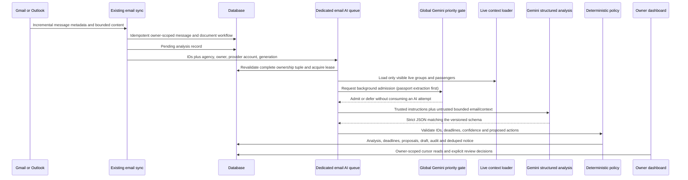

# AI Travel Operations Inbox

## Purpose

The AI Travel Operations Inbox turns the existing read-only Gmail and Outlook
integration into an account-isolated operations assistant. It classifies
travel-related mail, connects it to live groups and passengers, extracts
deadlines, prepares safe next steps and reply drafts, and notifies the mailbox
owner when attention is useful.

This is an extension of the existing email and document pipelines, not a
replacement for them. Gmail history sync, Microsoft Graph Inbox delta sync,
encrypted OAuth credentials, bounded PDF validation, duplicate detection,
canonical document ingestion, human review, audit events, and retention remain
the system of record.

The first production slice deliberately keeps provider permissions read-only.
It may prepare and approve a reply draft, but it does not send email.

## Existing-system assessment

The repository already provides:

- read-only Gmail and Outlook OAuth with PKCE and encrypted refresh tokens;
- incremental, lease-protected, duplicate-safe mailbox polling;
- normalized message excerpts and sanitized activity events;
- deterministic group and passenger matching;
- bounded PDF validation and the existing document-distribution pipeline;
- revision-safe human review actions;
- an agency/user notification table;
- a persistent authenticated dashboard shell and TanStack Query data layer.

The main pre-existing isolation gap is that email connections and downstream
records are scoped by agency. Super administrators can therefore query across
agencies, and records do not consistently preserve the user who connected the
mailbox. The AI inbox cannot be enabled safely until mailbox ownership is an
explicit, non-null database and authorization boundary.

There is no WebSocket, server-sent-event, or provider push transport in the
current platform. Gmail and Outlook are intentionally polled. The initial live
experience therefore uses compact, cursor-based notification polling, stops
background polling in hidden tabs, and refreshes on focus/reconnect. It can be
replaced by SSE later without changing the notification or inbox contracts.

## Invariants

1. **One mailbox, one owner.** Every connection, message, artifact, review,
   activity event, analysis, deadline, proposal, draft, feedback item, and AI
   notification retains `agency_id`, `owner_user_id`, and `connection_id`.
2. **No privileged mailbox bypass.** A super administrator may operate their own
   connected mailbox but cannot read another user's mailbox, even in the same
   agency.
3. **Worker context is explicit.** Asynchronous jobs carry connection, agency,
   owner, provider account, message, and generation identifiers. A worker
   reloads and compares all of them before reading or writing.
4. **Live facts are retrieved, not guessed.** Group/passenger context is loaded
   through the current user's existing visibility policy. Model-proposed IDs
   must exist in the retrieved candidate set.
5. **The model proposes; code decides.** Gemini has no application tools or
   database access. Typed output is validated and then interpreted by a
   deterministic policy/action registry.
6. **Consequential actions require approval.** Sending, deleting, changing
   identity/passport data, changing financial data, or acting on ambiguous
   entities is never automatic. Provider sending is out of scope while mailbox
   scopes remain read-only.
7. **Email is untrusted input.** Message content cannot change instructions,
   access policy, allowed actions, thresholds, or destinations.
8. **Retries are safe.** Provider uniqueness, analysis idempotency keys,
   proposal decision revisions, leases, and notification dedupe keys make
   replay harmless.
9. **Audit data is useful but bounded.** Store structured decisions, hashes,
   evidence codes, model/config versions, timings, and actor IDs. Do not retain
   raw provider payloads, OAuth secrets, signed URLs, or full model prompts and
   responses.
10. **Disabled means inert.** The feature flag stops new AI work without
    disabling mailbox synchronization, document ingestion, or access to
    previously created audit records.

Global enablement, an agency deny, a user deny, a connection deny, and the
owner's per-account opt-in form one fail-closed rollout chain. A matching deny
wins, and the API reports the same effective state enforced by workers.

## Ownership and authorization

`owner_user_id` is non-null on all email workflow records. New connections set
it from the authenticated OAuth initiator. OAuth callback state already retains
the initiating user and must match that same user and connection owner.

Every list and object lookup applies all available predicates:

```text
record.agency_id = current_user.agency_id
AND record.owner_user_id = current_user.id
AND record.connection_id belongs to the same owner and agency
```

Organization super administrators use their organization's default agency only
as a storage tenant; it does not weaken the owner predicate. Frontend role
visibility is convenience only. Backend object-level authorization is
authoritative.

Staff can connect and operate their own mailbox. Live group/passenger context is
limited to groups the existing authorization policy allows that staff member to
see (created or assigned groups). An email cannot be used to discover a hidden
group or passenger. Candidate groups come only from the message's existing
deterministic group link or a bounded scan of active groups the owner may
already view. That scan accepts a normalized full-name phrase or a
high-confidence spelling/acronym match, caps both the records inspected and
the candidates returned, and only exposes opaque candidates for later
confidence and ambiguity checks. Passenger candidates are loaded only for a
deterministic, visible `message.group_id`; name-only group retrieval never
expands a passenger roster.

Legacy rows are backfilled only when `created_by_user_id` identifies a valid
user in the same agency. Deployment readiness fails closed if a legacy active
connection cannot be assigned unambiguously; operators must assign or
disconnect it before enabling the AI feature.

## Data model

### Existing records

- `email_connections`: add non-null owner, per-account AI enablement and
  explicit opt-in watermark plus ownership-aware uniqueness/indexes.
- `email_messages`, `email_artifacts`, `email_artifact_documents`,
  `email_review_items`, and `email_activity_events`: add the non-null owner and
  ownership-aware query indexes.
- `notifications`: add priority/category, a dedupe key, and sanitized metadata.
  AI notifications always have a non-null target user.

### Intelligence records

`email_ai_analyses`

- one versioned analysis per message/idempotency key;
- status: pending, processing, completed, review_required, failed, ignored;
- intent, priority, short summary, confidence, needs_attention;
- linked group/passenger IDs only after server validation;
- structured evidence, risks, missing information, model/config/schema version;
- attempt count, lease, timestamps, duration, and sanitized error code.

`email_detected_deadlines`

- normalized UTC due time plus source timezone and source phrase;
- type, confidence, ambiguity flag, status, and resolution evidence;
- linked to the owning analysis/message.

`email_action_proposals`

- registry action type, risk level, explanation and typed payload;
- status: proposed, approval_required, approved, rejected, dismissed,
  completed, failed;
- optimistic revision, decision actor/time/note, execution idempotency key;
- no arbitrary URL, table, field, command, or recipient supplied by the model.

`email_reply_drafts`

- editable subject/body text, recipient addresses copied from validated message
  metadata, status and revision;
- model/config version and timestamps;
- no provider send token or send operation in this release.

`email_ai_feedback`

- correction type, field, original structured value, corrected structured value,
  optional bounded note, actor and timestamp;
- append-only and owner-scoped; used for evaluation, not online self-training.

`email_ai_rollout_policies`

- optional fail-closed agency, user, or connection deny records below the
  global flag;
- shape constraints and owner-aware foreign keys prevent cross-account policy
  rows;
- every API status and worker claim evaluates the same deny precedence.

## Processing sequence



Pending, processing, retry-wait, review-required and failure state is persisted
on the owner-scoped analysis record; completed decisions and human actions add
sanitized activity events. A pending-analysis dispatcher recovers work that was
committed but not enqueued, and an expired lease can be reclaimed.
Model/provider failures never block the existing document workflow. New mail is
scheduled fairly across owners with bounded per-owner and global in-flight
limits. The AI opt-in watermark prevents an unrequested historical backfill,
while all eligible post-opt-in messages are classified even if the earlier
deterministic document prefilter marked one as ignored.

## Gemini contract

The model name comes from the existing `GEMINI_MODEL` setting (whose current
default is `gemini-3.5-flash`). Business code never hardcodes a model name.
`EMAIL_AI_ENABLED`, per-account enablement, a schema version, timeouts, content
limits, and policy thresholds are separately configurable.

Input contains:

- a fixed trusted system instruction;
- sanitized sender display name/domain, recipient domains, connected-account
  domain, subject, bounded plain-text excerpt and attachment filenames; full
  mailbox addresses are not model context;
- message receive time and the configured `EMAIL_AI_DEFAULT_TIMEZONE`
  deployment fallback;
- a bounded list of candidate groups/passengers and allowed fields;
- an enumerated list of proposal types the server knows how to validate.

Untrusted content is fenced and described as data. The instruction explicitly
states that requests inside the email to ignore policy, expose information,
invoke tools, change recipients, or perform an action are malicious or
irrelevant content.

Output is strict JSON with no extra fields:

- relevance, intent, priority, summary and confidence;
- candidate links with evidence;
- deadline source phrase/expression/confidence for deterministic resolution;
- risks and missing information;
- proposals selected only from registry action types;
- an optional reply draft.

Pydantic validates types, lengths, enums and numeric ranges. A single bounded
repair attempt may be made for malformed JSON. If validation still fails, the
analysis becomes `review_required` or `failed`, with a safe owner notification
only when human attention is actually needed.

After schema validation, deterministic high-impact factual-anchor checks compare
all provider-authored display claims with the bounded sanitized input.
Unsupported summary, evidence, risk, missing-information or proposal text fails
closed to a safe review fallback; an unsupported draft is discarded and cannot
enable a draft-dependent proposal. A deadline resolves only when its expression
appears inside a source phrase that is itself visibly present in the bounded
subject/body, or is a whitelisted derivation from that exact visible source
phrase. Logs contain only the field, anchor count/types and model name, never raw
anchor values.

## Deadlines

The model identifies candidate deadline phrases; deterministic code resolves
them using the configured deployment fallback IANA timezone and the message
receive time. Account/user timezone storage is not present in this slice and
must not be implied by the UI or audit record.

Supported first-slice forms include:

- explicit ISO or calendar dates, optionally with a time;
- today/tomorrow and end-of-day;
- the bounded mixed-language future phrase `kal shaam tak`;
- within a bounded number of hours/days;
- named weekdays such as “by Friday”.

Missing timezone, conflicting phrases, past-but-actionable dates, vague terms
such as “soon”, and dates outside configured bounds are marked ambiguous and
sent for review. Stored due times are UTC; the original phrase and source
timezone remain visible.

The owner receives staged, deduplicated attention as an active deadline first
enters the configured window, reaches 24 hours, becomes due, and remains
overdue for 24 hours. The initial analysis notification records coverage for
the window and whichever stage is already current, so the scanner does not
repeat it immediately. Each stage key includes a fingerprint of the current
UTC due time: correcting a due date preserves audit history while giving the
new schedule its own reminders exactly once.

## Action policy and risk matrix

| Proposal | Risk | First-slice behavior |
|---|---:|---|
| Associate a validated group/passenger with the analysis | Low/medium | Persist one canonical visible match; multiple groups or duplicate-name passengers require review |
| Detect an internal deadline | Low | Store the deterministic deadline above threshold; no task/reminder mutation in Phase 1 |
| Prepare a reply draft | Medium | May be prepared automatically; editing/approval remains human and sending remains manual |
| Admit a validated PDF to document workflow | Existing policy | Continue the existing exact-match/review rules |
| Change itinerary, passenger identity, passport or finance data | High | Approval required; execution not introduced by AI |
| Send/reply/forward/delete mailbox content | High | Not available with read-only provider scopes |
| Follow a message link or fetch arbitrary content | High | Blocked; existing link retrieval remains disabled |

The action registry owns the allowed type, per-action minimum confidence, typed
payload validation, required evidence, permission check, approval mode and
idempotency strategy. Phase 1 has no operational executor; approving a
proposal records a decision only. Unknown action types fail closed.

## Notification decision policy

The inbox should reduce noise, not mirror every message. One deduplicated owner
notification is created only for:

- an approval or correction that blocks progress;
- a new unambiguous deadline inside the configured attention window;
- a reply draft ready for review;
- a high-risk or failed operation requiring a person.

Irrelevant/completed low-value mail produces no bell notification. Priority is
derived by deterministic policy from urgency, deadline, confidence and risk.
Notification metadata contains only display-safe account, provider, group,
deadline and action summary fields. Navigation is derived on the client from
known entity types and IDs; the server does not provide arbitrary destinations.

The first transport is a compact cursor endpoint:

- closed bell: refresh every 15 seconds;
- open bell: refresh every 5 seconds;
- no interval while the tab is hidden;
- immediate refresh on window focus and network reconnect;
- stable cursor/order and a server-derived unread count.

## User experience

The existing `/email-integrations` path remains Connections so OAuth return
behavior remains stable. Navigation becomes:

1. Operations Inbox (`/email-integrations/inbox`)
2. Review Queue
3. Activity
4. Connections

The dashboard header contains an accessible notification bell. Its panel has
priority and unread state in text as well as color, filters, mark-read and
mark-all actions, keyboard dismissal, outside-click dismissal and focus
restoration.

The Operations Inbox is one prioritized workspace with views for:

- Needs Attention
- Upcoming Deadlines
- Drafts Ready
- Waiting
- Analysis Complete (the API retains the `completed_automatically` key for
  compatibility; it means analysis finished with no open review item, not that
  an external or operational action was executed)
- All Activity

The existing message activity detail becomes the operational detail. It adds
analysis, live matches, deadline assumptions, risks, proposals, draft editing,
approval/rejection/dismissal, and correction feedback while retaining sanitized
plain-text email rendering and the existing artifact/audit timeline. An
allowlisted provider deep link is derived only from the owned connection and
stored provider message ID so the owner can open the original Gmail or Outlook
message; neither the model nor the client supplies that URL.

Correction feedback is available for both wrong and missing group, passenger,
deadline, category, priority, summary, draft and notification outcomes. A
fail-closed “no match” result is therefore correctable without granting a model
or browser permission to mutate the underlying operational record. Corrections
are typed and revision-checked; original values are derived on the server.
Semantic corrections dismiss stale open proposals and drafts, while editing a
bad draft records before/after feedback automatically.
Correction activity also records bounded, human-readable before/after labels
derived from the persisted feedback snapshots; the owner-only message timeline
never renders an unbounded snapshot or raw correction object.

When a detail workflow requests group or passenger review choices it can send
the owned `message_id` to `GET /api/v1/email-integrations/review-options`.
That context restricts every option to the message connection's agency; an
unknown or other owner's message is indistinguishable from a missing message.
The review queue may continue to call the endpoint without `message_id` and
retains its existing owner-authorized behavior.

Deadline decisions use optimistic concurrency under the deadline row lock.
Clients must echo both `status` and the timezone-aware `updated_at` returned by
the deadline response as `expected_status` and `expected_updated_at`; either
mismatch returns `409` and requires a refresh.

An owner may manually retry a terminal analysis with
`POST /api/v1/email-integrations/analyses/{analysis_id}/retry`. The server
revalidates the owner, mailbox lifecycle, current opt-in watermark and rollout
policy, then starts a fresh bounded attempt cycle. Manual retries are capped by
`EMAIL_AI_MAX_MANUAL_RETRIES` (default `3`) and cannot revive pre-opt-in or
human-marked-unrelated mail.

UI copy must say “Prepared draft — sending remains manual” until provider
permissions and a separately reviewed send workflow exist.

## Security controls

- Same-origin cookie authentication and CSRF validation on every state change.
- Server-side agency + owner + connection checks on every object.
- No raw HTML email rendering and no `dangerouslySetInnerHTML`.
- No model tools, arbitrary URLs, dynamic imports, database identifiers or
  executable instructions.
- Bounded input/output sizes, timeouts and attempts.
- Encrypted OAuth tokens remain deferred and never enter model context.
- Model/audit logging excludes raw message bodies and secret/provider payloads.
- AI and staged deadline notifications may include a linked group name only
  after resolving it through the mailbox owner's authorized, current-agency
  context; unavailable or newly hidden groups are omitted.
- Notification query keys include the current user and are cleared on logout or
  account change.
- Rate limits and optimistic revisions protect feedback, draft edits and
  decisions.
- Provider account and sync-generation checks prevent stale jobs from writing.
- The existing daily retention boundary also removes expired AI-derived
  content: summaries/context are scrubbed, source phrases, action/feedback
  payloads, and notification summaries/account metadata are redacted, and
  stale prepared drafts are deleted. Privacy-safe statuses, dates, confidence,
  decision actors and idempotency/audit facts remain.

## Evaluation and observability

The live semantic contract currently contains 22 versioned JSONL cases. They
cover relevant and irrelevant travel messages, missing subjects, forwarded
threads, revised and unclear attachments, replacement travellers, multiple
passengers, exact/ambiguous/hidden/misspelled/abbreviated group and passenger
candidates, explicit/relative/ambiguous/conflicting deadlines, reply drafting
with missing facts, and prompt-injection or forbidden-action attempts.

Duplicate delivery and retry, cross-owner and cross-agency access, malformed or
oversized provider output, timeout, and provider unavailability are exercised
separately by deterministic unit and regression suites. They are not counted
as live semantic fixture cases.

The synthetic evaluation harness sends every fixture through the same
`GeminiEmailAnalysisService` structured-response parser, deadline resolver and
action policy used at runtime. Expected relevance, category, priority, links,
review routing, deadline, blocked-action, unsent-draft and forbidden-content
fields are all asserted; cases may not be silently skipped.

For a billable release check against the configured provider, export
`GOOGLE_API_KEY` in the backend environment and run from the repository root:

```bash
cd backend
python -m scripts.evaluate_email_ai_live --confirm-live-provider --min-pass-rate 0.90
```

The model, timeout, review threshold, and deadline threshold default to the
deployed `Settings`; optional CLI overrides are range checked. The command
prints only case IDs, result status and bounded failure labels. It does not
print fixture messages, prompts, API keys or provider payloads. Any provider
status other than `analyzed`, or any failed critical safety case, is a hard
release failure regardless of aggregate pass rate.

This slice does not claim a dedicated email-AI metric exporter or dashboard.
Operators can derive queue/completion/failure/review counts, latency,
proposals, notifications, corrections, deduplication, pending age and lease
recovery from the persisted owner-scoped analysis, activity, notification,
feedback and audit records. The existing shared Gemini priority coordinator
continues to expose admission metrics without mailbox content; dedicated
email-AI charts remain follow-up work.

Evaluation gates require zero cross-owner disclosures, zero unknown action
execution, deterministic retry behavior, bounded failure recovery, and preserved
existing email/document test suites.

## Rollout and rollback

Super administrators have an audited Connections-page safety panel backed by
`GET /api/v1/admin/email-ai-rollout` and
`PUT /api/v1/admin/email-ai-rollout`. It lists bounded agency and user targets,
plus only the requesting SuperAdmin's own mailbox targets; it never exposes
another user's connected account identity. The panel shows both the direct
setting and the effective deny-wins result and uses optimistic timestamps for
changes. An explicit allow at a child scope cannot override a paused agency or
the global kill switch, and no rollout setting overrides the mailbox owner's
separate opt-in.

1. Apply the additive migration with AI disabled.
2. Resolve any legacy connection whose owner cannot be safely backfilled.
3. Deploy backend, email worker, dedicated email AI worker, email Beat and
   frontend together. Verify the `email_ai` queue and shared Gemini priority
   coordinator before enabling analysis.
4. Enable `EMAIL_AI_ENABLED` for an internal mailbox only, while keeping
   provider scopes and external actions read-only.
5. Verify account isolation with two users in one agency and a super
   administrator.
6. Compare fixture and shadow-mode results before enabling owner notifications.
7. Expand by account after reviewing false positives, deadlines and corrections.

Rollback sets `EMAIL_AI_ENABLED=false` and recreates the backend, email worker,
email AI worker and email Beat. This stops new analyses and notifications but
preserves mailbox sync, document processing, reviews, existing intelligence
records and audit history. Database downgrade is not an operational rollback.

## Deferred work

- SSE/WebSocket delivery after an authenticated, tenant-safe event transport
  exists;
- full thread-state aggregation for commitments, unresolved questions and
  follow-up reasoning; this slice analyzes each synchronized message with its
  bounded stored excerpt, including quoted or forwarded text already present;
- broader live-state aggregators for rooming completeness, passport counts,
  itinerary impact and export preparation;
- provider write scopes and a separately approved send workflow;
- allowlisted link retrieval;
- online learning from feedback;
- organization-wide shared operations mailboxes with explicit grants;
- automatic high-risk operational mutations.
